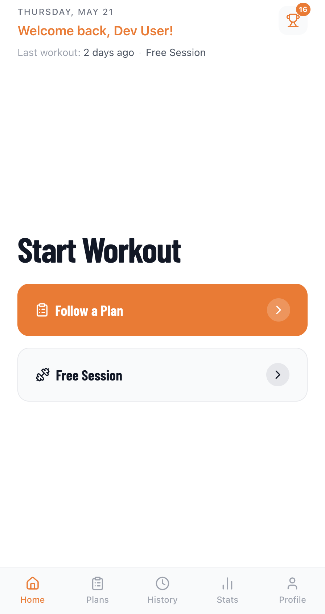
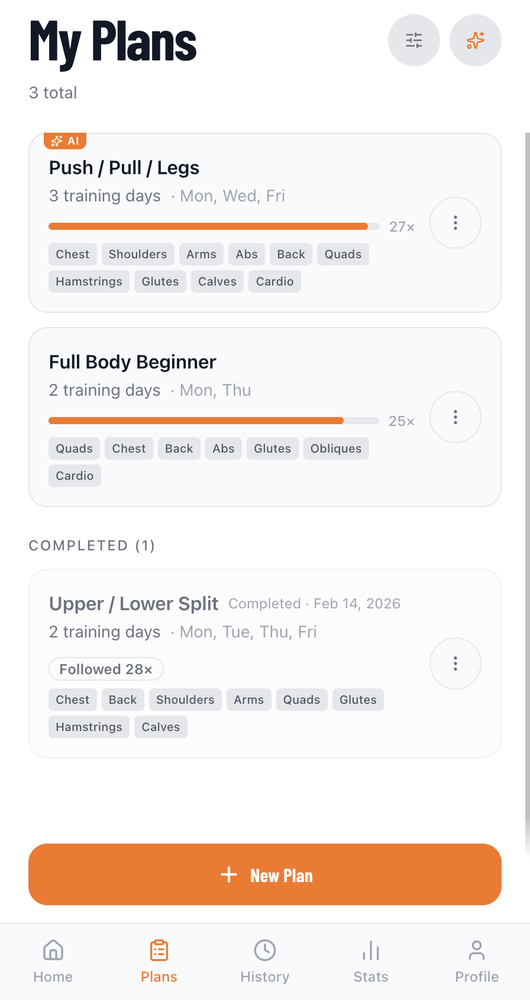
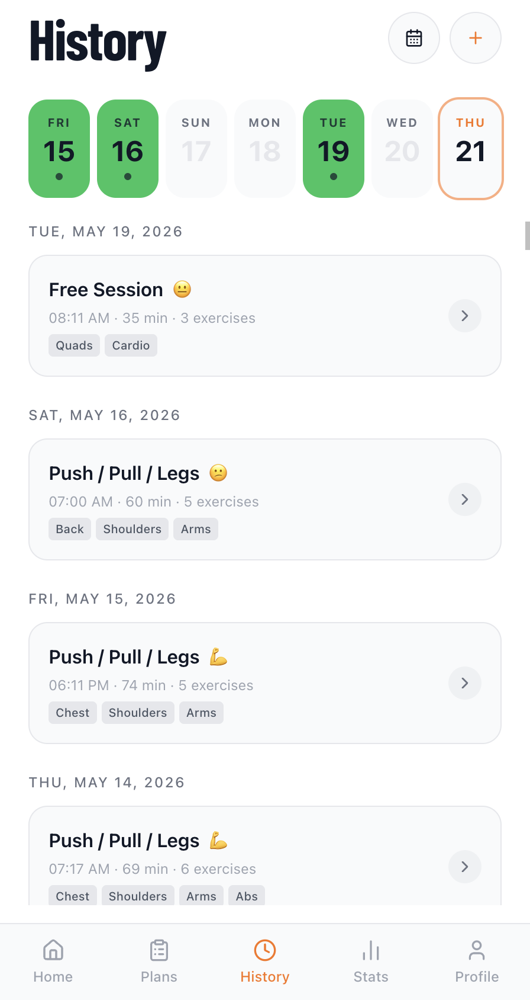
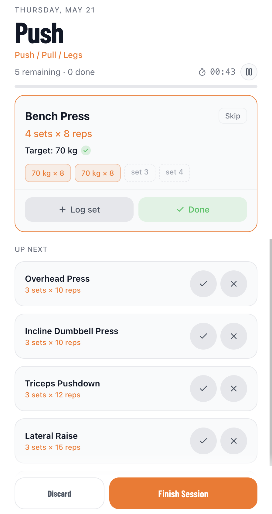
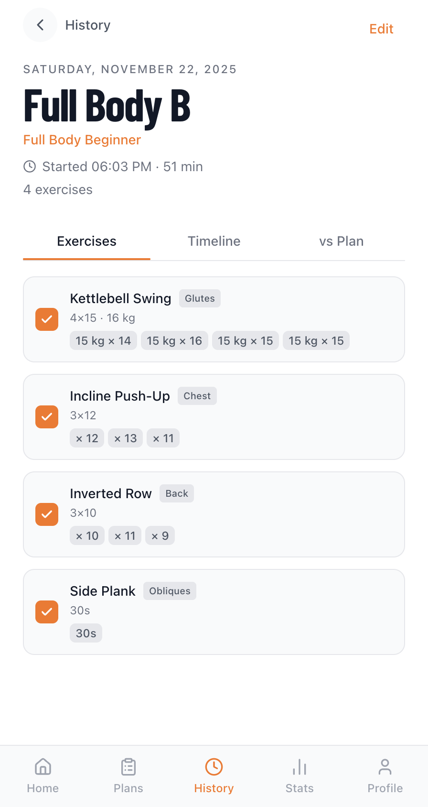
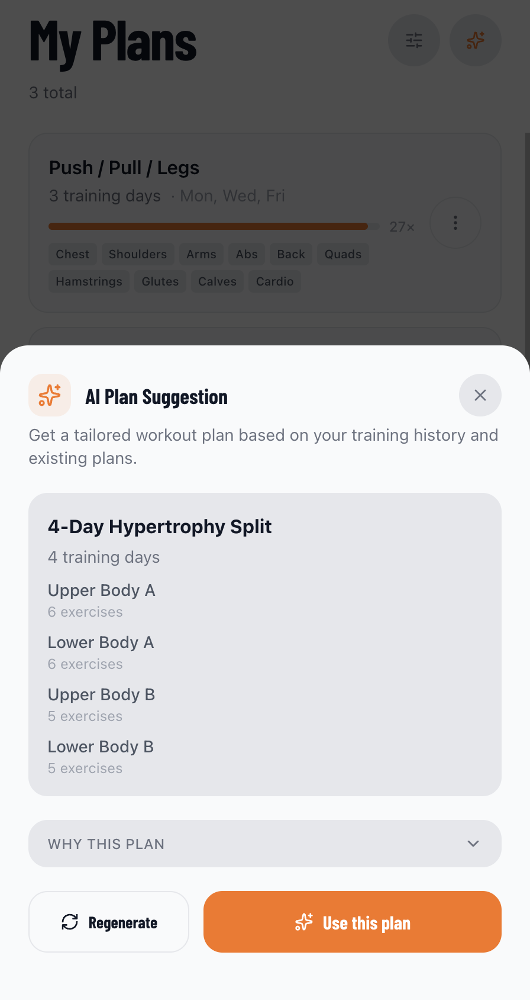
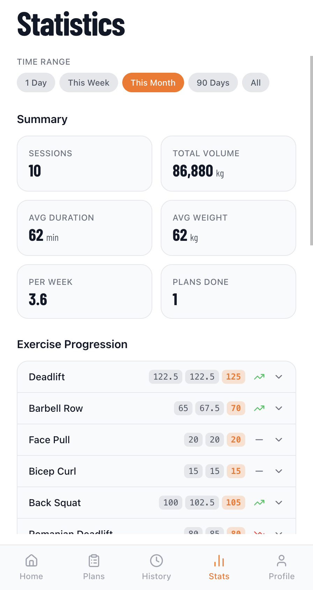
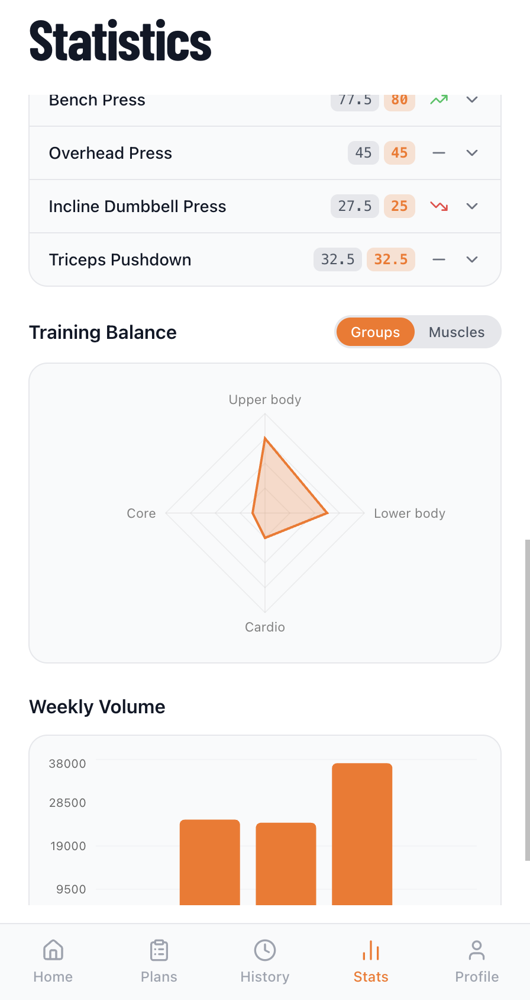
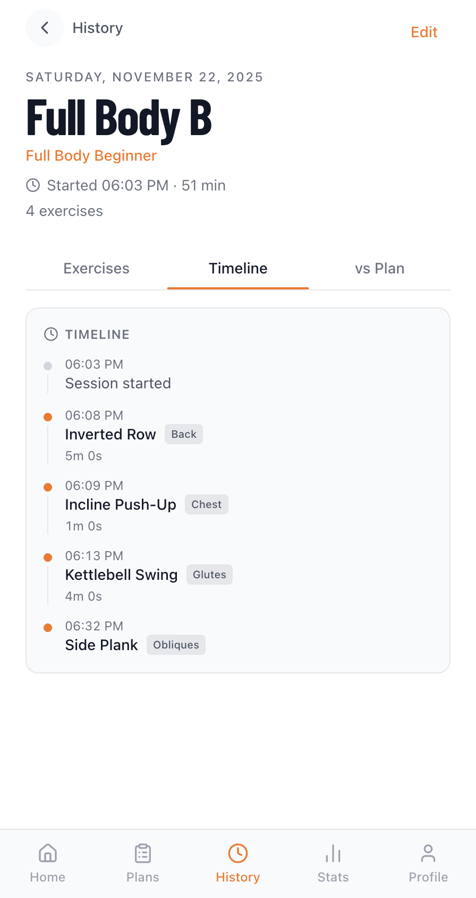

# 🏋️ Workout Sessions Tracker

> A **personal learning project** for building real, context-aware AI features into a product — wrapped in a mobile-first workout tracker I actually use. Log sessions, follow plans, and visualize progress, then let AI use your **full training history, plans, and progression** to suggest the next plan, swap an exercise, or parse a free-form workout into structured sets. Bring your own OpenAI or Gemini key; all data stays in your browser.

I mainly use it to experiment with LLM features on real data — building context envelopes, prompt design, structured output, provider abstraction — on a domain I know well. It happens to be a workout tracker I use. MIT-licensed, no backend yet — everything runs client-side for now.

[](https://github.com/tkrisztian95/workout-session-tracker/actions/workflows/ci.yml)
[](https://sonarcloud.io/summary/new_code?id=tkrisztian95_workout-session-tracker)
[](LICENSE)

**[🚀 Live Demo](https://workout-session-tracker.vercel.app)** · **[Contributing](CONTRIBUTING.md)** · **[Security](SECURITY.md)**

---

## 📱 Screenshots

| Home                                    | Plans                                     | History                                       |
| --------------------------------------- | ----------------------------------------- | --------------------------------------------- |
|  |  |  |

| Session in progress                                         | Session — exercises (review)                                | AI plan generation                                       |
| ----------------------------------------------------------- | ----------------------------------------------------------- | -------------------------------------------------------- |
|  |  |  |

| Statistics — summary                              | Statistics — charts                                      | Session — Timeline & vs Plan                                     |
| ------------------------------------------------- | -------------------------------------------------------- | ---------------------------------------------------------------- |
|  |  |  |

See [public/screenshots/README.md](public/screenshots/README.md) for the full index — including the AI preferences sheet, loading state, and session vs-plan comparison.

## ✨ Why this app

- **A playground for context-aware AI.** The whole point: every AI feature receives your full training context — completed sessions, weight progression per exercise, active plans, profile, and preferences. Plan suggestions, exercise swaps, and free-form workout parsing are grounded in **what you actually did**, not a blank-slate prompt. Bring your own key; the app works fully without one.
- **Bring your own provider.** Use an OpenAI **or** Google Gemini key — pick the provider and model in settings. The key is stored in your browser and requests go straight from the browser to the provider, never through a server I run.
- **Local-first for now.** No backend yet — every plan, session, and stat lives in `localStorage`. No account or database needed to use it.
- **Mobile-first.** Built for the phone, not for a desktop with a phone view bolted on. Bottom nav, drum pickers, modal sheets, large tap targets.
- **Open and hackable.** MIT-licensed Next.js app. Fork it, run it locally, learn from it.

## 🎯 Features

- 🏃 **Workout Sessions** — Start free-form or plan-based sessions with a real-time timer. Log sets, reps, weights, and durations per exercise. Pause and resume anytime. Rate the session on completion.
- 📚 **Exercise Catalog** — A built-in starter list of common machines and movements, each with a muscle group and sensible default sets/reps, so you can drop an exercise into a plan or session without typing it from scratch.
- 📋 **Workout Plans** — Multi-day plans with core and optional exercises per day, plus shared exercises that apply to every day. Schedule days by weekday. Search, filter, and sort across active and completed plans.
- 📅 **Session History** — Browse completed sessions on a weekday strip and a date-range timeline. Drill into any session for sets, durations, plan-vs-actual comparison, and a per-exercise timeline. Manually log past sessions.
- 📊 **Statistics** — Volume, frequency, average duration, plans completed. Exercise weight progression with trend indicators and line charts. Muscle-group distribution radar. Volume bar chart with time-range filters.
- 🤖 **AI Plan Suggestions** — Personalized plans (OpenAI `gpt-4o`/`gpt-4o-mini` or Gemini `2.5-flash`/`2.5-pro`) generated with the full corpus of your past sessions, weight progression, existing plans, and stated preferences sent as context. Each suggestion comes with a "why this plan" rationale you can read before importing.
- 🔄 **AI Exercise Swap** — Replace any exercise in an active plan with an AI-suggested alternative that matches the muscle group, equipment, and your prior performance on similar movements.
- 🤖 **AI Import Workout from Notes** — Paste a free-form session description ("did 5×5 squats at 100, then 3 sets of pull-ups…") and have AI parse it into structured exercises and sets, using your exercise history to disambiguate names.
- 🏆 **Achievements** — Earned milestones (first session, weight PRs, streaks, plan completions) with a celebration overlay.
- ⚙️ **Profile & Settings** — Name, sex, age, height, weight. Theme (light / dark / system). Language (English, Hungarian, German). Data export / import.

## 🛠 Tech Stack

- **[Next.js 16](https://nextjs.org/)** (App Router) + **[React 19](https://react.dev/)**
- **[TypeScript 5](https://www.typescriptlang.org/)**, strict mode
- **[Tailwind CSS 4](https://tailwindcss.com/)** with semantic color tokens
- **[Recharts](https://recharts.org/)** for stats charts
- **[Lucide](https://lucide.dev/)** for icons
- **[Vitest](https://vitest.dev/)** for unit tests
- **[OpenSpec](https://github.com/Fission-AI/OpenSpec)** for spec-driven feature work
- Deployed on **[Vercel](https://vercel.com/)**, analytics via **[PostHog](https://posthog.com/)** (opt-in)

## 🚀 Getting Started

```bash
git clone https://github.com/tkrisztian95/workout-session-tracker.git
cd workout-session-tracker
npm install
cp .env.example .env.local   # optional — see env vars below
npm run dev
```

The app runs at [http://localhost:3000](http://localhost:3000). On first load in development, [`DevSeed`](src/components/DevSeed.tsx) populates `localStorage` with six months of realistic sample sessions and three plans so you have something to look at immediately.

### Environment variables

Every env var is optional — the app works fully offline without any of them.

| Variable                                                    | Purpose                                                                                                                                          |
| ----------------------------------------------------------- | ------------------------------------------------------------------------------------------------------------------------------------------------ |
| `NEXT_PUBLIC_POSTHOG_KEY`                                   | Enables PostHog analytics. Leave unset to disable PostHog entirely (no init, no script).                                                         |
| `NEXT_PUBLIC_POSTHOG_HOST`                                  | PostHog ingest host (defaults to `https://eu.i.posthog.com`).                                                                                    |
| `OPENAI_API_KEY`                                            | Only used by `npm run eval`. At runtime the app reads the user's key from `localStorage` — it never reads this file in browser code.             |
| `NEXT_PUBLIC_GEMINI_API_KEY` / `NEXT_PUBLIC_OPENAI_API_KEY` | Dev/preview-only fallback so AI features work without entering a key in the UI. Never set these in production. See [.env.example](.env.example). |

See [.env.example](.env.example) for the full template.

## 🏗 Architecture at a glance

- **`src/app/`** — App Router pages and layouts. Each top-level route maps to a major feature (home, plans, history, stats, profile).
- **`src/components/`** — UI components. Generic primitives live under `src/components/ui/`.
- **`src/lib/`** — Storage layer (`storage.ts`), domain types (`types.ts`), muscle taxonomy (`muscles.ts`), AI clients (`ai/`), session/stats utils.
- **`src/lib/devSeed.ts`** + **`src/lib/dev-seed-data/`** — Schema-validated JSON corpus that seeds dev `localStorage` with realistic history and plans on first load.
- **`openspec/`** — Feature proposals, designs, and capability specs. See the [OpenSpec workflow in AGENTS.md](AGENTS.md#feature-development-with-openspec).
- **`docs/data-structure.md`** — The persisted data shape: every `localStorage` key, every persisted type, every migration, and the export payload.

The architecture is intentionally flat. There is no global state store, no service worker, no background sync. State reads from `localStorage` on mount and writes synchronously on user action. The `useEffect`/mount-gate pattern in [`HomePage`](src/app/page.tsx) and friends exists specifically to avoid hydration mismatches with `localStorage`-derived UI.

## 📜 Scripts

| Command                     | Description                                                   |
| --------------------------- | ------------------------------------------------------------- |
| `npm run dev`               | Start the development server                                  |
| `npm run build`             | Build for production                                          |
| `npm start`                 | Run the production build                                      |
| `npm test`                  | Run unit tests with Vitest                                    |
| `npm run lint`              | Run ESLint                                                    |
| `npm run lint:fix`          | Auto-fix lint issues                                          |
| `npm run format`            | Format the repo with Prettier                                 |
| `npm run format:check`      | Check formatting without writing                              |
| `npm run eval`              | Run the AI-prompt evaluation harness (needs `OPENAI_API_KEY`) |
| `npm run dev-seed:generate` | Regenerate the dev-seed JSON corpus                           |
| `npm run dev-seed:validate` | Validate dev-seed JSON against schemas                        |

## 🤝 Contributing

Contributions are welcome. The repo uses a [spec-driven workflow](AGENTS.md#feature-development-with-openspec) for non-trivial features and [Conventional Commits](https://www.conventionalcommits.org/) for commit messages. See [CONTRIBUTING.md](CONTRIBUTING.md) for the full guide.

To report a security issue, see [SECURITY.md](SECURITY.md).

## 🚫 Non-goals

To keep the project focused, this app intentionally does **not**:

- Offer a hosted multi-user backend or account system.
- Sync data across devices automatically (use the export / import flow instead).
- Bundle exercise videos, GIFs, or a curated exercise library — exercise names are free-form.
- Compete with full-featured commercial trackers like Strong, Hevy, or FitNotes.

If any of those things are dealbreakers for you, this isn't the right project.

## 📄 License

[MIT](LICENSE) © Krisztian Toth
