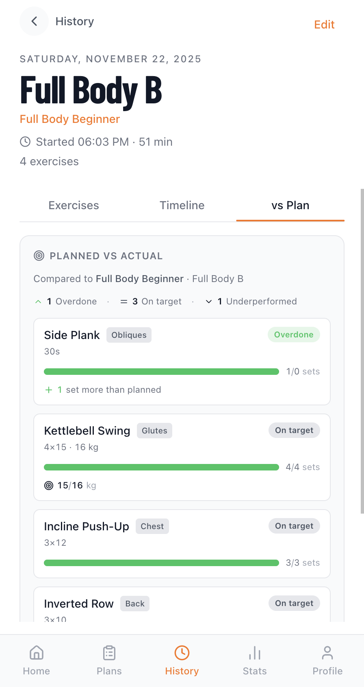

# 🏋️ Workout Sessions Tracker

> A mobile-first, privacy-first workout tracker. Plan training, log sessions, visualize progress — all data stays in your browser. Generate AI-tailored plans using your own OpenAI key.

[](https://github.com/tkrisztian95/workout-session-tracker/actions/workflows/ci.yml)
[](LICENSE)
[](https://vercel.com/new/clone?repository-url=https://github.com/tkrisztian95/workout-session-tracker)

**[🚀 Live Demo](https://workout-session-tracker.vercel.app)** · **[Contributing](CONTRIBUTING.md)** · **[Security](SECURITY.md)**

---

## 📱 Screenshots

| Home                                    | Plans                                     | History                                       |
| --------------------------------------- | ----------------------------------------- | --------------------------------------------- |
|  |  |  |

| Statistics — summary                              | Statistics — charts                                      | Session — exercises                                         |
| ------------------------------------------------- | -------------------------------------------------------- | ----------------------------------------------------------- |
|  |  |  |

| Session — timeline                                               | Session — vs Plan                                              | AI plan generation                                       |
| ---------------------------------------------------------------- | -------------------------------------------------------------- | -------------------------------------------------------- |
|  |  |  |

See [public/screenshots/README.md](public/screenshots/README.md) for the full index and what each screenshot is meant to show.

## ✨ Why this app

- **Privacy-first.** No account, no backend, no database. Every plan, session, and stat lives in `localStorage`.
- **Mobile-first.** Built for the phone, not for a desktop with a phone view bolted on. Bottom nav, drum pickers, modal sheets, large tap targets.
- **AI-assisted, not AI-locked.** Bring your own OpenAI key. The app works fully without it — AI is an opt-in upgrade for plan suggestions, exercise swaps, and "import workout from notes."
- **Open, hackable, forkable.** MIT-licensed Next.js app. Deploy your own copy on Vercel in a click, or run it locally and never touch the network.

## 🎯 Features

- 🏃 **Workout Sessions** — Start free-form or plan-based sessions with a real-time timer. Log sets, reps, weights, and durations per exercise. Pause and resume anytime. Rate the session on completion.
- 📋 **Workout Plans** — Multi-day plans with core and optional exercises per day, plus shared exercises that apply to every day. Schedule days by weekday. Search, filter, and sort across active and completed plans.
- 📅 **Session History** — Browse completed sessions on a weekday strip and a date-range timeline. Drill into any session for sets, durations, plan-vs-actual comparison, and a per-exercise timeline. Manually log past sessions.
- 📊 **Statistics** — Volume, frequency, average duration, plans completed. Exercise weight progression with trend indicators and line charts. Muscle-group distribution radar. Volume bar chart with time-range filters.
- 🤖 **AI Plan Suggestions** — Generate personalized plans (`gpt-4o-mini` or `gpt-4o`) based on your training history and preferences. Review the suggestion in full before importing.
- 🔄 **AI Exercise Swap** — Replace any exercise in an active plan with an AI-suggested alternative that matches the same muscle group and equipment profile.
- 📝 **Import Workout from Notes** — Paste a free-form session description and have it parsed into structured exercises and sets.
- 🏆 **Achievements** — Earned milestones (first session, weight PRs, streaks, plan completions) with a celebration overlay.
- ⚙️ **Profile & Settings** — Name, sex, age, height, weight. Theme (light / dark / system). Language (English, Hungarian, German). Data export / import.

## 🛠 Tech Stack

- **[Next.js 16](https://nextjs.org/)** (App Router) + **[React 19](https://react.dev/)**
- **[TypeScript 5](https://www.typescriptlang.org/)**, strict mode
- **[Tailwind CSS 4](https://tailwindcss.com/)** with semantic color tokens
- **[Recharts](https://recharts.org/)** for stats charts
- **[Lucide](https://lucide.dev/)** for icons
- **[Vitest](https://vitest.dev/)** for unit tests
- **[OpenSpec](https://github.com/Fission-AI/OpenSpec)** for spec-driven feature work
- Deployed on **[Vercel](https://vercel.com/)**, analytics via **[PostHog](https://posthog.com/)** (opt-in)

## 🚀 Getting Started

```bash
git clone https://github.com/tkrisztian95/workout-session-tracker.git
cd workout-session-tracker
npm install
cp .env.example .env.local   # optional — see env vars below
npm run dev
```

The app runs at [http://localhost:3000](http://localhost:3000). On first load in development, [`DevSeed`](src/components/DevSeed.tsx) populates `localStorage` with six months of realistic sample sessions and three plans so you have something to look at immediately.

### Environment variables

Every env var is optional — the app works fully offline without any of them.

| Variable                   | Purpose                                                                                                                                     |
| -------------------------- | ------------------------------------------------------------------------------------------------------------------------------------------- |
| `NEXT_PUBLIC_POSTHOG_KEY`  | Enables PostHog analytics. Leave unset to disable PostHog entirely (no init, no script).                                                    |
| `NEXT_PUBLIC_POSTHOG_HOST` | PostHog ingest host (defaults to `https://eu.i.posthog.com`).                                                                               |
| `OPENAI_API_KEY`           | Only used by `npm run eval`. The app reads the user's OpenAI key from `localStorage` at runtime — it never reads this file in browser code. |

See [.env.example](.env.example) for the full template.

## 📦 Self-hosting

This is a fully static-friendly Next.js app — no database, no server-side state. You can host it anywhere:

- **One-click deploy to Vercel:** use the button at the top of this README. Set `NEXT_PUBLIC_POSTHOG_KEY` only if you want analytics; everything else is optional.
- **Any Node host:** `npm run build && npm start`.
- **Static export:** the app degrades gracefully — only `/history/[id]` and `/plans/[id]` are dynamic (they read from `localStorage` on the client).

Your fork's PostHog will only ingest events if you set your own `NEXT_PUBLIC_POSTHOG_KEY`. The upstream key is never bundled.

## 🏗 Architecture at a glance

- **`src/app/`** — App Router pages and layouts. Each top-level route maps to a major feature (home, plans, history, stats, profile).
- **`src/components/`** — UI components. Generic primitives live under `src/components/ui/`.
- **`src/lib/`** — Storage layer (`storage.ts`), domain types (`types.ts`), muscle taxonomy (`muscles.ts`), AI clients (`ai/`), session/stats utils.
- **`src/lib/devSeed.ts`** + **`src/lib/dev-seed-data/`** — Schema-validated JSON corpus that seeds dev `localStorage` with realistic history and plans on first load.
- **`openspec/`** — Feature proposals, designs, and capability specs. See the [OpenSpec workflow in AGENTS.md](AGENTS.md#feature-development-with-openspec).
- **`docs/data-structure.md`** — The persisted data shape: every `localStorage` key, every persisted type, every migration, and the export payload.

The architecture is intentionally flat. There is no global state store, no service worker, no background sync. State reads from `localStorage` on mount and writes synchronously on user action. The `useEffect`/mount-gate pattern in [`HomePage`](src/app/page.tsx) and friends exists specifically to avoid hydration mismatches with `localStorage`-derived UI.

## 🔒 Data & Privacy

All user data (profile, plans, sessions, achievements, AI config) is stored exclusively in the browser's `localStorage` under `wst_*` keys. The app never sends this data to any server except:

- **PostHog** — anonymous usage analytics. Only when `NEXT_PUBLIC_POSTHOG_KEY` is configured **and** the user accepts the consent prompt. Form values for `name`, `sex`, and the AI API key field are scrubbed before send.
- **OpenAI** — only when you explicitly trigger an AI feature with your own API key. The key is stored in `localStorage`, the request goes directly from your browser to `api.openai.com`, and the app never proxies it.

There is no telemetry beyond what's listed above. There is no third-party script loaded that you don't see in [`src/app/layout.tsx`](src/app/layout.tsx).

## 📜 Scripts

| Command                     | Description                                                   |
| --------------------------- | ------------------------------------------------------------- |
| `npm run dev`               | Start the development server                                  |
| `npm run build`             | Build for production                                          |
| `npm start`                 | Run the production build                                      |
| `npm test`                  | Run unit tests with Vitest                                    |
| `npm run lint`              | Run ESLint                                                    |
| `npm run lint:fix`          | Auto-fix lint issues                                          |
| `npm run format`            | Format the repo with Prettier                                 |
| `npm run format:check`      | Check formatting without writing                              |
| `npm run eval`              | Run the AI-prompt evaluation harness (needs `OPENAI_API_KEY`) |
| `npm run dev-seed:generate` | Regenerate the dev-seed JSON corpus                           |
| `npm run dev-seed:validate` | Validate dev-seed JSON against schemas                        |

## 🗺 Roadmap

This is a personal hobby project, so the roadmap is a wish list, not a commitment.

- [ ] Exercise instructions and form cues
- [ ] Rest timer between sets with haptic feedback
- [ ] Body-weight / measurements tracking with chart overlay
- [ ] PWA install + offline-ready service worker
- [ ] Per-exercise notes that survive across sessions
- [ ] Apple Health / Google Fit export

Open an issue if you want to discuss anything on this list — or anything off it.

## 🤝 Contributing

Contributions are welcome. The repo uses a [spec-driven workflow](AGENTS.md#feature-development-with-openspec) for non-trivial features and [Conventional Commits](https://www.conventionalcommits.org/) for commit messages. See [CONTRIBUTING.md](CONTRIBUTING.md) for the full guide.

To report a security issue, see [SECURITY.md](SECURITY.md).

## 🚫 Non-goals

To keep the project focused, this app intentionally does **not**:

- Offer a hosted multi-user backend or account system.
- Sync data across devices automatically (use the export / import flow instead).
- Bundle exercise videos, GIFs, or a curated exercise library — exercise names are free-form.
- Compete with full-featured commercial trackers like Strong, Hevy, or FitNotes.

If any of those things are dealbreakers for you, this isn't the right project.

## 📄 License

[MIT](LICENSE) © Krisztian Toth
